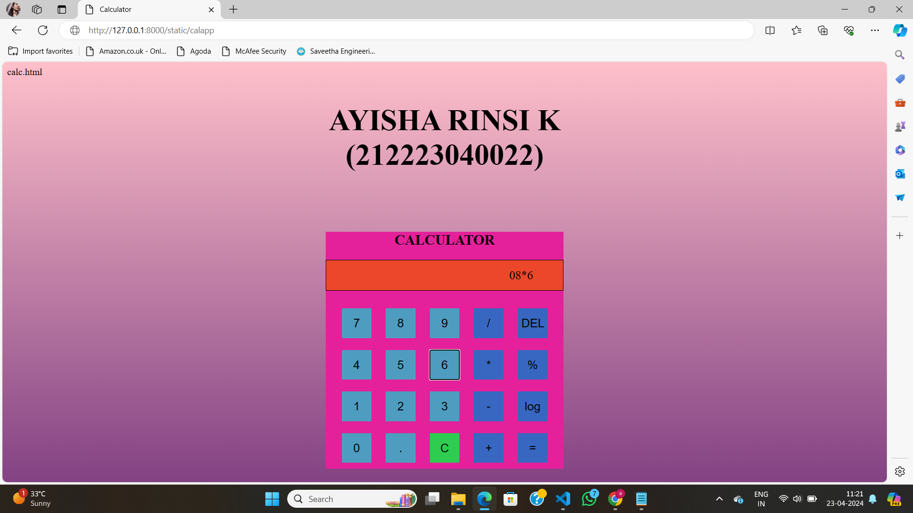

# Ex.08 Design of a Standard Calculator
## Date:23/04/2024

## AIM:
To design a web application for a standard calculator with minimum five operations.

## DESIGN STEPS:

### Step 1:
Clone the github repository and create Django admin interface.

### Step 2:
Change settings.py file to allow request from all hosts.

### Step 3:
Use CSS for creating attractive colors.

### Step 4:
Write JavaScript program for implementing five different operations.

### Step 5:
Validate the HTML and CSS code.

### Step 6:
Publish the website in the given URL.

## PROGRAM :
```
calc.html

<!DOCTYPE html>
<html lang="en">
    <head>
        <title>Calculator</title>
    
        <style type="text/css">
            body{
                background-image: linear-gradient(rgb(216, 132, 216),rgb(216, 132, 216));
                height: 150px;                
            }
        </style>
        
        <script>
        function calculate(args)
        {
            res = document.getElementById("result");
            expression = res.innerText;
            cmd = args.srcElement.innerText;
            if(cmd == "=")
            {
                expression = "" + eval(expression)
            }
            else if(cmd == "C")
            {
                expression=""
            }
            else if(cmd == "DEL")
            {
                expression = expression.slice(0, -1);

            }
            else if(cmd == "%")
            {
                expression = "" + Math.sqrt(eval(expression));
            }
            else if(cmd == "%")
            {
                expression = expression % 1;
            }
            else if(cmd == "log")
             {
        expression = Math.log10(expression);
           }
       
            else{
                expression = expression + cmd;
            }
            res.innerText = expression;
            

        }
         
        </script>

        <style>
          
            .calculator-container {
                width: 400px;
                
                background-color:rgb(228, 33, 154);(8, 8, 8);
                margin: 0 auto; 
                margin-top: 100px;
                text-align: center;

                
            }

           
            button {
                width: 50px;
                height: 50px;
                margin: 10px; 
                font-size: 20px; 
                
                
                background-color: rgb(78, 157, 192); 
                color:blue(255, 255, 255); 
                border: none;
            }

          
            #result {
                
       background-color:#82574f;
    text-align: right;
    padding-right: 50px;
    font-size: 20px;
    margin-bottom: 20px; 
    border: solid black 0.5px;
    color: black;
    width: 348px;
    height: 50px;
    display: flex;
    align-items: center;
    justify-content: flex-end;

            }
            h1 {
                padding-top: 10px;
                color:aquamarine(255, 255, 255);
                font-size: 50px;
            }
            .redd {
                background-color: rgb(213, 103, 163);
            }
            .bluee {
                
                background-color: rgb(213, 103, 163);
            }
            body {
                background-color: rgb(213, 103, 163);
            }
            #pozhilan{
                text-align: center;
            }
            .calculator-container{
                margin-bottom: 50px;
            }

        </style>

    </head>
<body>
   
    <h1 id="pozhilan"> AYISHA RINSI K<br>(212223040022)</h1>
    <div class="calculator-container">
        <h2> CALCULATOR</h2>
        <div id="result">0</div>
        <button onclick="calculate(event);">7</button>
        <button onclick="calculate(event);">8</button>
        <button onclick="calculate(event);">9</button>
        <button class="bluee"  onclick="calculate(event);">/</button>
        <button class="bluee"  onclick="calculate(event);"> DEL </button><br>
        <button onclick="calculate(event);">4</button>
        <button onclick="calculate(event);">5</button>
        <button onclick="calculate(event);">6</button>
        <button class="bluee"  onclick="calculate(event);">*</button>
        <button class="bluee"  onclick="calculate(event);">%</button><br>
        <button onclick="calculate(event);">1</button>
        <button onclick="calculate(event);">2</button>
        <button onclick="calculate(event);">3</button>
        <button class="bluee"  onclick="calculate(event);">-</button>
        <button class="bluee"  onclick="calculate(event);">log</button><br>
        <button onclick="calculate(event);">0</button>
        <button onclick="calculate(event);">.</button>
        <button class="redd" onclick="calculate(event);">C</button>
        <button class="bluee"  onclick="calculate(event);">+</button>
        <button class="bluee" onclick="calculate(event);">=</button><br>
    </div>
</div>
    </body>
</html>
```
## OUTPUT:


## RESULT:
The program for designing a standard calculator using HTML and CSS is executed successfully.
